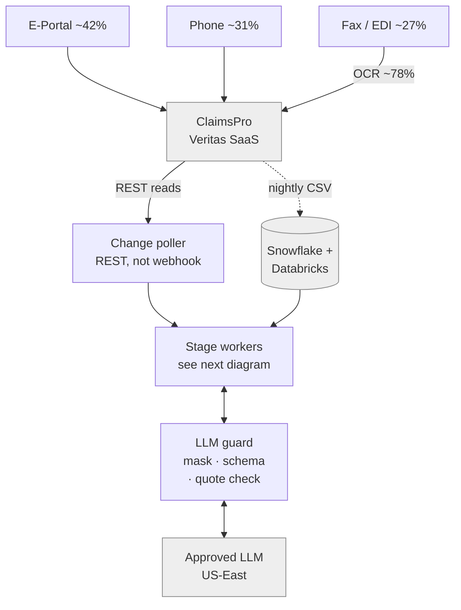
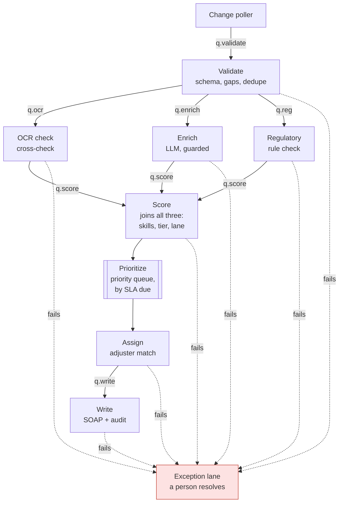
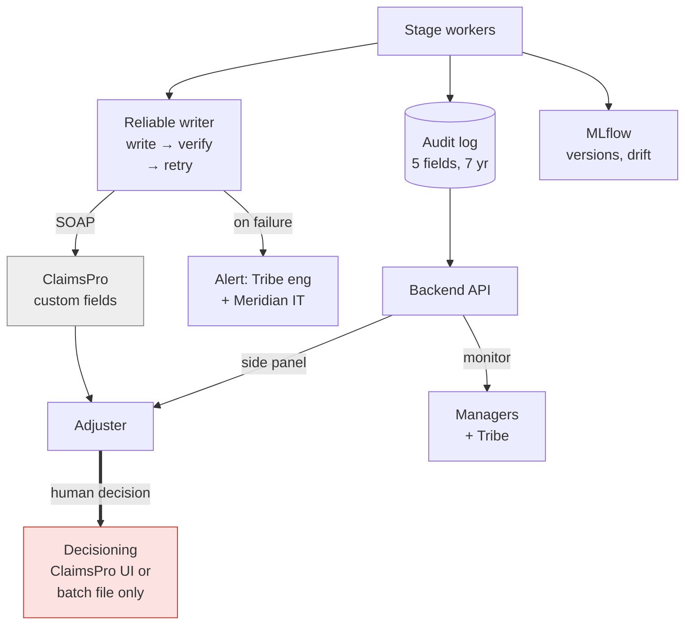
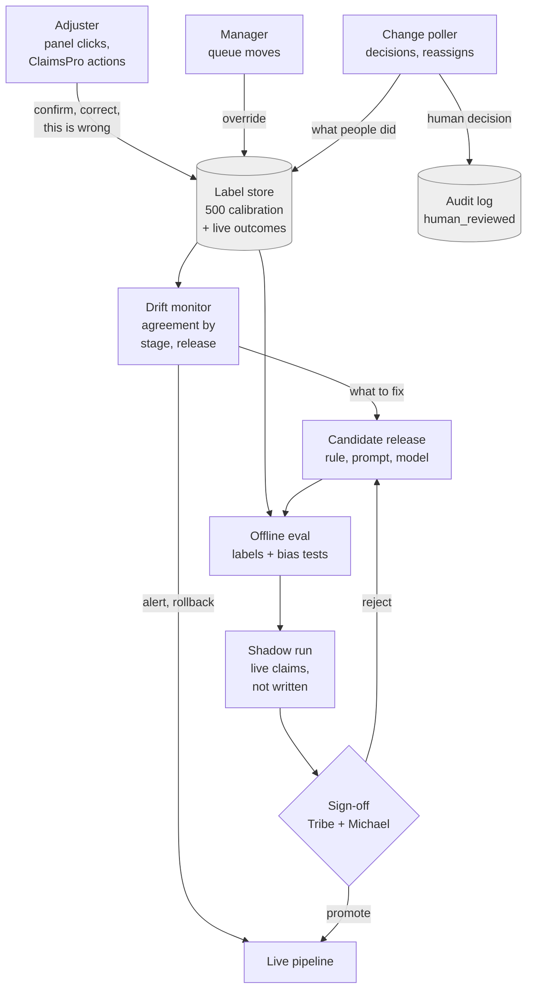
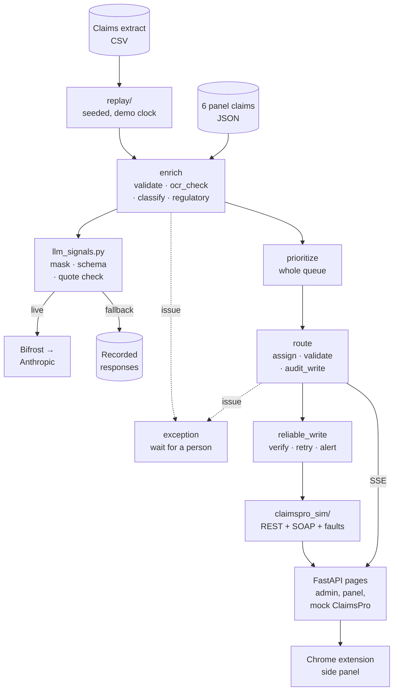

# Engineering architecture

The proposed production shape shows where the routing and pre-processing pipeline sits relative to Meridian's systems. The demo diagram shows what was actually built, so a reviewer can map each production box to the code that stands in for it.

The governing constraint is the box from slide 4 (`docs/presentation/slides_draft.md`, "Slide 4"). We build beside ClaimsPro and never inside it or instead of it. Our output lands in ClaimsPro's own fields (path 4), and the overlay sits beside ClaimsPro's screen (path 5). Claim decisions stay with people.

## Production (proposed)

Split in four so each diagram fits a narrow preview: data in, the pipeline's stage workers, data out, and the feedback loop that closes it.

### Data in: from intake to a routing decision

### Pipeline: parallel stages, each with its own queue

Each stage is one concern with its own queue, so it can be scaled on its own. Work runs in parallel two ways:

- **Across claims.** Many claims are in flight at once, so a claim waiting on the LLM holds up only itself.
- **Within a claim.** After validation, the OCR check, Enrich and the regulatory check fan out at the same time, because none needs another's output. This matches the demo's code: `ocr_cross_check`, `complexity_signals` and `regulatory_check` each read only the claim. Score is the join. It runs when all three results are in, because the tier needs the LLM signals and the review lane needs the tier, the regulatory status and the OCR findings. A claim the model is slow on still has its OCR and regulatory results ready when the signals arrive.

On day one, a single shared pool of workers takes tasks from every queue. When a stage becomes the bottleneck, it scales out (more workers on that queue) or splits off into a specialist pool sized and limited for that work. Enrich is the likely first split, because it is bound by LLM latency and the provider's rate limit, not by CPU. Its workers wait on the network, so each one should hold many calls open at once (async I/O) rather than one call per worker.

**Where the long poles are.** Two things limit throughput: inference (LLM latency and provider quota) and ClaimsPro's limits (SOAP-only writes, REST reads, a nightly export). The stages, queues and parallel fan-out exist to keep those two from stalling everything else. Python's own speed, queue overhead and blob reads and writes on standard cloud storage (S3 or similar) are not long poles at any of the volumes below. A rule check or an OCR comparison takes milliseconds; an LLM call takes seconds.

The queue technology is deliberately not chosen. RabbitMQ, a Python queue on Redis, or a managed service all fit. The architecture needs only a middleware queue that workers pull from, with stages split along clean lines so each can scale on its own. The per-claim state passed between stages goes with the task or in a store keyed on claim ID.

| Annual volume | Average rate | Shape |
|---|---|---|
| 400K (today) | ~1,100 claims/day, ~0.01/s | One shared pool, two workers for redundancy |
| 4M | ~0.13/s | Shared pool autoscaled on queue depth; Enrich and Write split out with their own rate limits |
| 400M | ~13/s, more at peak | A specialist pool per stage, queues partitioned by claim ID; Assign partitioned by adjuster pool |

What makes this work, and what doesn't scale with workers:

- **Stages are idempotent.** Queues deliver at least once. Each stage's output is keyed on the claim ID and a hash of its input (as `input_data_ref` already is), so a redelivered task is a no-op. Writes already reuse one idempotency key across retries.
- **Prioritize becomes a priority queue, not a batch sort.** The demo's sort key (`demo/backend/pipeline/rules.py`, `priority_key`) orders by time left to the SLA, which is the same order as the absolute due time. Keying the queue on due time, then review-required, then tier gives the same order without a batch.
- **Assign owns shared state.** Adjuster load is a running count that every assignment changes. Partition the assign queue by adjuster pool (skill and tier), so one consumer owns each pool's counts, instead of letting workers race on them.
- **Failures go to people.** A stage that fails, or a task that runs out of retries, lands in the exception lane, the same fail-safe as the demo's `exception` node. Nothing is dropped and nothing is guessed.
- **One trace per claim.** A trace ID travels with every task, so MLflow traces and the audit record can be stitched together across stages.
- **The ceiling is outside our service.** Workers scale; ClaimsPro's SOAP writes, the LLM provider's quota and the 95 adjusters do not. Write and Enrich get their own rate-limited pools first, so a slow vendor backs up a queue instead of the whole pipeline.

### Data out: from the decision to people

### Feedback loop: how we know it's right, and keep knowing

Michael's bar for production is "if the team cannot show him how they know it's right, and keep showing him, it does not go near live claims" (`memory/calltranscripts/w1-thu-michael-systems.md`, summary). Both earlier attempts failed on this: the 2021 score shipped with no loop and drifted unseen, and the RAG effort never reached anything that could be checked. This loop is the answer, and it is as much a part of the architecture as the pipeline.

**Labels.** Every place a person disagrees with, or confirms, the pipeline becomes a labeled example, tied to the claim ID, the stage and the release that produced the output:

- **Adjuster in the side panel:** confirm, correct (with the corrected value) or "this is wrong". The demo records these already (`CorrectionLogEntry` in `demo/backend/models.py`); confirmed intake writes back to ClaimsPro (commit `c0eaf53`).
- **Manager on the queues board:** a manual move is an override of Assign.
- **What happens in ClaimsPro:** the change poller already reads each claim, so it also sees reassignments, escalations to review, and the final human decision. These are the labels nobody has to click for.
- **The 500 Q4 2025 calibration labels** (`review_actually_needed` in the extract) seed the store before any live outcome exists.

**Closing the audit record.** The pipeline writes each record with `human_reviewed=False` (`demo/backend/pipeline/audit.py`). When the poller sees the human decision on that claim, it appends the reviewer and the outcome to the record (never overwriting it). The five-field record is complete only then, and the rationale for an appeal shows both what the pipeline said and what the person decided.

**Drift monitoring.** Agreement with reviewers, per stage and per release, over time: the demo's learning-loop chart, built from real labels. A drop raises an alert, and a release that regresses is rolled back to the previous version. The demo's mocked history has one (`demo/data/history.json`, week 11: signals-prompt v1.2 over-flagged injury mentions, so v1.1 came back).

**Releases.** Rules, prompts and models change only through a versioned release, never by live editing (compliance):

1. **Offline eval** against the label store, including bias tests for the NAIC commitments. A release has to match or beat the live one.
2. **Shadow run** on live claims: the candidate runs beside the live pipeline, and its output is recorded but not written to ClaimsPro. This replaces staging, which runs on 3-month-old data.
3. **Sign-off** by Tribe and Michael's team, with the eval and shadow results attached. Promotion is a version switch, so rollback is the same switch back.

Every stage stamps its output with its release version, so labels, drift and audit records can all be cut by release.

> **Process assumptions.** The loop above is the architecture's shape, not an agreed process. Who signs off, what "match or beat" means in numbers, how long a shadow run lasts, what drop in agreement triggers a rollback, and which ClaimsPro reads carry the human decision all need to be worked out with Meridian before adoption and final implementation. They are listed under "Still open".

### How to read it

| Element | What it is | Source |
|---|---|---|
| **No arrow from our service into Decisioning** | No API exists for claim decisioning, and the gap is deliberate. Approvals and denials go only through the ClaimsPro UI or the batch file, by a person. Our service routes, orders and explains. It never approves or denies. | `memory/calltranscripts/w1-thu-michael-systems.md` (5:45) |
| **Change poller, not webhook** | The webhook delays events by ~15 minutes and silently drops ~5% of them. New and changed claims are found by polling REST reads, which are documented and fast. The webhook could serve as an early hint but is never the only trigger. | Systems (4:40) |
| **Reliable writer** | Writes are SOAP only. Each write is checked with a REST read, retried with backoff under one idempotency key, and raised to people once retries run out. A failed write sends the claim to a human. It is never shown as routed. | Systems (4:40); `demo/backend/claimspro_sim/reliable.py` |
| **Custom fields as the v1 adjuster view** | Skills, tier, routing reason, review lane and brief status are written into ClaimsPro custom fields. The extension adds the side panel beside the existing screen. If the extension is down, the fields still show in ClaimsPro. | `docs/discovery/open_questions.md` (I3, I5, I6); slide 4 notes |
| **LLM guard** | Only one step uses a model: complexity signals. Identifiers are masked before the call, and a leak check refuses to send anything that survives masking. Output must pass a strict schema. Every signal must quote its source, and code verifies the quote. The schema has no approve, deny or recommendation field. If the call fails, a recorded response is used instead. | `demo/README.md` ("What contains the output"); decision 4 |
| **Decision audit log** | The five required fields (input data, model version, output, confidence, human-reviewed flag) plus a readable rationale, kept for 7 years. This has to be built: Datadog captures application events only. | Systems summary; `demo/backend/pipeline/audit.py` |
| **MLflow** | Each stage is a LangGraph node, traced and logged in MLflow, Meridian's existing registry, so rule, prompt and model releases are versioned and the eval and shadow results attach to the release. Drift monitoring is new: none exists today. | Decision 7; Systems (34:20) |
| **Databricks hosting** | Model Serving is live, with spare capacity. Michael's team provides integration support only, so Tribe builds and runs the service. | Systems (34:20, 35:35) |

### Still open

These answers could change the diagram. The IDs refer to `docs/discovery/open_questions.md`.

- **Hosting and audit store.** The diagram assumes the service runs on Databricks and the audit log is a Databricks table, because that is where the platform and MLflow already are. No one has confirmed this.
- **SSO for the backend API (I7).** It is unknown whether the side panel can use the adjuster's ClaimsPro identity.
- **Canadian residency.** Canadian policyholder data has residency rules, and LLM calls route through US-East. Until Meridian's remediation lands, Canadian claims may need to skip the LLM step and be routed on rules only.
- **Notes limits (I4).** These decide whether the brief is written as a note, a document, or only a custom-field status.
- **Release sign-off (process assumption).** The diagram has Tribe and Michael's team approving each release. Michael asked for evidence, not for an approval step; who signs off, and whether Compliance or Claims Operations joins them, is to be agreed.
- **Release thresholds (process assumption).** The eval bar ("match or beat the live release"), shadow-run length, and the agreement drop that triggers a rollback are placeholders. They need numbers, set with Meridian against the calibration labels, before the loop can run.
- **Human decision from ClaimsPro (process assumption).** Closing the audit record assumes the REST reads expose the final decision and who made it. Unconfirmed; if they don't, the decision has to come from the nightly export, which delays closing the record by up to a day.
- **Unstructured joins.** Notes, transcripts and OCR live in Databricks, and structured data lives in Snowflake. No single-claim view exists yet. The pipeline needs one at run time, not only a nightly join.

## Demo (as built)

Each production piece has a local stand-in. The pipeline, rules, LLM guard, reliable writer and audit record are the real code. ClaimsPro, the feed and the history are simulated.

| Production | Demo stand-in |
|---|---|
| ClaimsPro REST/SOAP | `claimspro_sim/` with injectable faults (`/sim/faults`) |
| Stage queues and workers | One in-process LangGraph graph. Each node is one stage, so moving it behind a queue keeps its logic; Assign's shared load count is the part that needs reworking |
| Change poller | `replay/`, which plays the extract in filed-date order and is seeded so rehearsals match |
| Snowflake + Databricks reads | `reference/claims_processing.csv` and the fixture JSON |
| Decision audit log | `AuditRecord` in memory; `audit_view.py` merges it with write history and review intervals |
| Label store | `CorrectionLogEntry` log in memory (`GET /api/corrections`); queue moves in the simulator's write log |
| Drift monitor and release history | `data/history.json`, mocked, with one rollback |
| Managed extension | `demo/extension/`, loaded unpacked |
