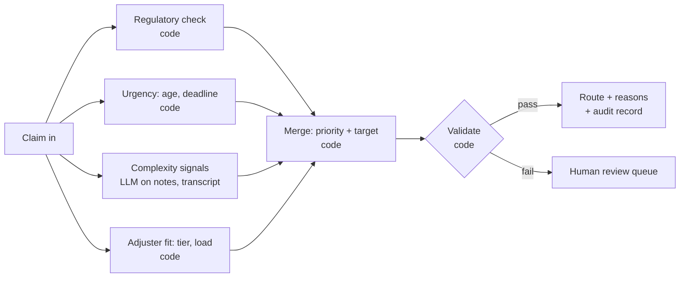

# Slides draft: Meridian discovery readout

Draft content for transfer to Keynote. Each slide has a headline (the claim the slide makes), body content, and speaker notes with sources. Numbers are reproducible with `python3 analysis/review_floor.py`; section numbers refer to its output.

**Order and timing (30 min talk):**

| # | Slide | Role | Time |
|---|---|---|---|
| 1 | The point of view | Design | 2 min |
| 2 | The regulatory gap | Context (PM) | 3 min |
| 3 | The SOW targets, read honestly | Context (PM) | 2 min |
| 4 | Five ways to work with a legacy system | Context (architect): the box every design lives in | 2 min |
| 5 | What we're not building yet | Design decisions | 3 min |
| 6 | Who this changes, and how we'll know | Design | 3 min |
| 7 | Where the first pass goes | Design | 2 min |
| 8 | How we got here | Process | 2 min |
| — | Demo | | ~10 min |

Slides 2–4 are deliberate: about 5 minutes of PM and architect context, because the design decisions on 5–7 can't be judged without it. Keep them to time.

---

## Slide 1: The best change is one the adjuster barely notices

**Headline:** The car runs better; the dashboard doesn't change.

**Body:**

- **Who:** 95 adjusters on ClaimsPro, eight screens deep. The primary user is the second-year adjuster: claim IS-CLM-2025004222 took him 208 hours, 117 of them waiting in a queue.
- **The point of view:** fix what happens *before* the adjuster opens a claim: intake, validation, prioritization, routing to the right person. Show the result in ClaimsPro's own fields. Add new interface only where the existing one hits a wall.
- **The human stays in the loop:** the adjuster makes every decision. The system prepares, orders, explains, and records; it never approves or denies.
- **The ideal, set aside:** an adjuster opens ClaimsPro and sees one thing, the next right claim for them. ClaimsPro can't be made to work that way, but every step moves toward it.

**Speaker notes:**

- Ground it in 4222 before any numbers: phone intake, a rough auto-transcript, a timeline built by hand, unsure on coverage, four days in senior review (Ops, 56:10–62:15).
- "Don't build us an eighth screen" (Ops, 86:20). Sandra's own bet: "half my cycle-time problem is a dispatch problem" (Ops, 20:15).
- Sources: `sample_claims/IS-CLM-2025004222/`; `memory/calltranscripts/w1-tue-sandra-ops-walkthrough.md`.

---

## Slide 2: We found a possible regulatory gap before building anything

**Headline:** Up to 437 claims in the sample needed a human by regulation and may never have been routed to one.

**Body:**

- Two flags on every claim:
  - `requires_human_by_regulation`: set by rules; matches "over $10K in a listed state" exactly in 12 states
  - `flagged_for_human_review`: a second-opinion signal, from a person or low AI confidence
- **437 claims (8.7%)** have the regulation flag and no review flag:
  - **85** are over $10K in one of the 12 states: the stated rule, clearly required
  - **352** are in 8 other states (AZ, IN, MO, NC, TN, TX, WA, WI), 340 of them $10K or under. No known rule explains them
- **The question for engineering:** which flag decides whether a claim reaches a human?
  - **Either flag:** nothing is skipped, but the 352 reach humans for reasons nobody can explain. That's a feasibility problem for the review-rate target, not a compliance one.
  - **Review flag only:** at least 85 required reviews skipped, ~6,800 a year at 400K volume; up to 437, ~35,000 a year.
  - **Neither directly** (for example, the 2021 score): ask open-ended.
- **The fix, if needed:** route to a human when *either* flag is set. One condition in the routing rule. Value before any AI.

**Visual:** a 2×2 of the two flags (regulated yes/no × flagged yes/no); the "regulated, not flagged" cell split 85 / 352.

**Speaker notes:**

- Lead the context section with this. It's the kind of evidence Michael said makes him a champion (Systems, 37:45). Raise it with him privately first; it's a gap in his system.
- Framing: "we need engineering to confirm how routing filters (M14)". Don't claim the gap is confirmed.
- The 12 states: 8 named in discovery (CA, NY, NJ, FL, IL, PA, OH, GA), 4 inferred from the data (MA, MD, MI, VA: every claim over $10K is flagged, none under). Confirm the list.
- The 352 (part of the 628 in those 8 states flagged regulated): the ~30% rate is uniform across all 8, less spread than chance. One leftover rule fits best; eight independent state laws don't. Point: nobody can say why the flag is set.
- Tension to name before Pooja does: the fix *raises* the review rate (45.6% → 47.3% under the stated rule; 54.3% on the labels as they stand).
- It's Meridian's change: rules-engine configuration in a SaaS system, through CAB.
- Sources: `docs/discovery/open_questions.md` ("Quick win", "Review floor, revised"); script sections 6 and 9.

---

## Slide 3: The SOW targets, read honestly

**Headline:** One target is within reach, one is hard, and two need redefining.

**Body:**

| Goal | Target | Read | Why |
|---|---|---|---|
| Cycle time | 68h → <24h (simple) | **Reachable** | Simple claims wait 41.7h in queue for 6.1h of handling. Cap the wait at 12h and ~96% land under 24h. It's a routing problem. |
| Cost to serve | −25% blended | **Hard** | Moving *all* fax/EDI to the portal saves ≤8.8%. Needs lighter human work per claim, not just channel shift. |
| Review rate | 45% → <20% | **Near-impossible as measured** | Floor is 12.9% under the stated rule (25.4% as labeled). Even a perfect second-opinion flag leaves ~39%. Closing the gap on slide 1 raises it. |
| CSAT | 3.2 → >4.0 | **Needs redefining** | Denials average 2.24. Non-denied claims would need to average 4.39; today only 5% of them score a 5. 41% of claims have no response. |

**Proposal:** agree measurement plans in the scope document, as the SOW provides. Replace "flag rate" with human minutes per claim or full-review rate; measure CSAT on non-denied claims and communication.

**Speaker notes:**

- The SOW calls targets "directional" and says measurement plans are defined in discovery (`docs/project/sow.md:12`, `:21`). This is the process, not a renegotiation.
- Review rate: a flag doesn't change a claim's cost or speed once complexity is held fixed (script section 8). So what was <20% for? Likely "less human effort per claim". Measure that directly (R5).
- The narrow path to <20% exists: cut *needed* second opinions from 34% of claims to ~7%. Not realistic in six months, on a legacy system we don't control.
- CSAT: "Speed alone will not carry satisfaction" (`reference/analytics_memo.md:27`).
- Sources: script sections 8 and 9; the "Already answered from the data" section of `open_questions.md`.

---

## Slide 4: Five ways to work with a legacy system; two fit here

**Headline:** We build beside ClaimsPro, not inside or instead of it. This is the box every design has to live in.

**Body:**

| # | Approach | Verdict | Why |
|---|---|---|---|
| 1 | Replace the UI; ClaimsPro as a headless backend | ✗ | Claim decisions can only be entered in the ClaimsPro UI or by batch file, by design |
| 2 | Build inside ClaimsPro with a vendor SDK or plugin | ✗ | No SDK exists |
| 3 | Replace ClaimsPro | ✗ | A system-of-record migration doesn't fit 6 months and $5M |
| 4 | **Write into ClaimsPro's own fields** (notes, custom fields) | ✓ | Custom fields exist; SOAP writes cover notes and documents. Durable, auditable, survives if anything else breaks |
| 5 | **Overlay beside ClaimsPro** (managed browser extension) | ✓ | SaaS in a browser; IT can force-install. Reads the open claim, shows our panel, calls our backend |

**Visual:** five columns, three greyed out; 4 and 5 joined by a bracket labeled "together".

**Speaker notes:**

- This is strategy, not plumbing: it rules out every design that depends on replacing or re-skinning ClaimsPro. The next slide is the design choices made inside this box.
- 4 and 5 work together, in that order: custom fields come first, as the record and the adjuster's v1 view (they also feed ClaimsPro's own rules and reports). The overlay comes only when the fields hit a wall. If the extension is ever down, the fields still show in ClaimsPro.
- Also rejected: bots driving the ClaimsPro screens. They break on every vendor release and would route around the deliberate decisioning gap.
- Not a UI path, but worth one line: fixing fax OCR *before* it enters ClaimsPro (it lands today with no human check).
- If OCR correction comes up: today the LLM may fix characters only, never words, and code checks the corrected text word by word against the raw OCR. On 2993, dropping `n0t` as noise would flip "not consistent with a fresh impact", the evidence behind the denial. Horizon: models that predict meaning rather than the next token (JEPA-style) may handle this more reliably; none are ready for documents, so it's one to watch over the next couple of years, not to build on now.
- "Don't build us an eighth screen" (Ops, 86:20). Neither path adds one: the fields live in ClaimsPro, and the overlay sits on the screen adjusters already use.
- Sources: Systems, 4:40 and 5:45; clarification call (SaaS, no SDK, custom fields, force-installable extensions).

---

## Slide 5: What we're not building yet, and when it would come back

**Headline:** No new interface for adjusters until the existing one hits a wall.

**The assumption everything rests on:** ClaimsPro's custom fields are prominent on the screens adjusters already use, and make sense there. The first version is built on that. If it's wrong, or the fields read badly in the legacy UI, the same content moves into the side panel for display, and stays stored as custom fields in ClaimsPro.

**Body:**

| Rejected for now | Why | Where it could come back |
|---|---|---|
| **A separate app in another tab** | Adds the ninth screen; splits attention | Managers only: the pipeline monitor is its own page. A link from ClaimsPro's own menus is P3, only if adoption lags |
| **Rebuilding the eight-screen experience** | No decision API, SOAP-only writes; not doable in six months | A side-panel summary and table of contents: reads the claim, raises what matters, links to where each point lives. **The first side-panel version** |
| **A chat agent** | An interface looking for a problem; we try no new interface first | P2/P3, in the same side panel. Also the visible "AI" executives can point to |
| **A training and precedent tool** | Pre-processing notes in custom fields cover part of the need first | Added to the side panel later: the second-year adjuster's top ask |

**Sequence:** no new adjuster UI (pre-processing, routing, custom fields) → one side panel (summary and table of contents) → the same panel gains research, then chat if it earns a place.

**Speaker notes:**

- Name the tension before Carlos does: "We spent $5M and nobody sees anything different." The answer: the change is visible where it's measured, in the pipeline monitor for Sandra, leadership, and us. The side panel is the tangible thing on the adjuster's screen, once routing has earned trust.
- Also rejected: auto-approval. A one-click, human-confirmed fast lane instead. Consent for automated adjudication is untracked in 8 states, and claims over $10K need human review in 12.
- Precedent search is deferred, not dismissed. Built from old notes, it copies past judgment forward, bias included; the NAIC bias-testing commitment applies.
- Open question for Michael: where do custom fields render (I3 confirmed they exist, not where they show)?

---

## Slide 6: Who this changes, and how we'll know

**Headline:** Five groups, three flows that change, and a measure for each at design time and in production.

**Stakeholders:**

| Who | What they need | What changes for them |
|---|---|---|
| **Adjusters** (95; the second-year is the primary user) | Claims that arrive ready to decide; a reference for hard calls; no eighth screen | Queue arrives ordered; custom fields say why a claim is theirs and what's prepared or missing; a side panel later, if earned; corrections take one click |
| **Senior adjusters and leads** (16) | Time back for complex files; fewer interruptions | Hard claims arrive already routed to them; fewer "can you look at this" escalations |
| **Sandra, claims ops** | Cycle time down without burning people out | A dispatcher she can tune; visibility into why claims sit |
| **Michael and Compliance** | "Show me how you know it's right, and keep showing me" | Every route and summary explained and logged; the regulatory gap closed; drift visible |
| **Carlos** | Cost down, demonstrated not promised | A measured path on the targets that are reachable |

Not direct users but affected: claimants (faster, better-explained outcomes) and the call center (phone intake feeds the same brief later).

**Flows:**

| Flow | Change | Design-time measure (prototype, pilot) | Production measure (OKR) |
|---|---|---|---|
| **Routing: claim arrives → queue → adjuster** | *Change:* round-robin becomes ordered and matched; routes on both flags | Replay the extract: simulated queue wait vs actual; 0 regulated claims unrouted; adjusters agree with the route on sampled claims | **O:** Claims reach the right adjuster without waiting. **KR:** simple-claim median cycle <24h (today 34.7h; 34% under 24h); 0 regulated claims without a review step; escalations to senior review down X% |
| **Preparation: claim opened → ready to decide** | *Create:* pre-processing results in custom fields (v1); the side-panel summary and table of contents (v2) | Adjuster task test on sample claims: time to first decision, fields re-keyed, "I trust this" rating; extraction accuracy vs adjuster-corrected values | **O:** Adjusters decide, not reassemble. **KR:** handling minutes per claim down X%; second opinions down (26% needed today); brief accuracy ≥ agreed bar on audited sample |
| **Correction: adjuster disagrees → system learns** | *Create:* the learning loop | Corrections take one action; a rule fix finds the similar claims in bulk (the 85) | **O:** The system gets more right each month, visibly. **KR:** correction rate trending down; drift alerts reviewed within a week; no silent rule changes |

**Speaker notes:**

- X% targets are placeholders, agreed in the scope document with Sandra and Michael; the baselines are real and from the extract.
- Change management (Nikolina): pilot with one team and the adjusters who shaped it; nothing takes a decision away from them; the old score comes off the screen only once the new routing has earned trust (M6).
- Every production measure needs a baseline agreed before launch, or month 3 becomes an argument about numbers.

---

## Slide 7: Where the first pass goes

**Headline:** Get the right claim to the right adjuster, ready to decide.

**Body:** three layers, each feeding the next:

1. **Pre-processing and routing (deep):** validate intake and catch what's missing; route on both flags; order queues by age and deadline; send hard claims to the right adjuster first. Moves cycle time, the one reachable target.
2. **Custom fields (the adjuster's view, v1):** why the claim was routed, its review lane, what's been prepared or is missing. The record in ClaimsPro, and all the adjuster sees change.
3. **Pipeline monitor (managers and us):** claims moving through intake, validation, enrichment, prioritization, assignment; exceptions that need a human before an adjuster sees them.

**The loop:** every correction (wrong route, missed review, bad extraction) feeds back into the rules, so the next hundred claims don't need the same fix.

**Next, if earned:** the side panel (summary and table of contents). **Out of scope for now:** auto-approval, precedent search, chat.

**Speaker notes:**

- Why routing: Sandra's own first fix (Ops, 20:15), and it moves the one target within reach.
- Human in the loop: the adjuster owns every decision. Exceptions go to a person, never to a default.
- Learning loop example: fix the routing rule once, and the 85 are caught in bulk.

---

## Slide 8: How we got here

**Headline:** From the transcripts to a decision, in five steps, checking each one.

**Body:**

1. **Read the record:** SOW, three discovery calls, the analytics memo, the three sample claims.
2. **Wrote down every question,** with who could answer it and why it mattered; a clarification call closed the ones that blocked design (`docs/discovery/open_questions.md`).
3. **Tested the claims in the data,** in a script anyone can re-run, instead of trusting the memo or ourselves (`analysis/review_floor.py`). This is where the flag gap and the target reads came from.
4. **Took positions, then revised them:** auto-approval became a one-click fast lane; skill routing moved from P3 to P2; the review floor changed from 25% to 13% once the stated rule came in.
5. **Picked one adjuster and one claim** and built it end to end, rather than sketching everything.

**Tools:** AI agents for reading, analysis, and building, with every number sourced to a file and checked by a script. Everything shown here is mine to defend.

**Speaker notes:**

- For Charles: the iterations matter more than the steps. Have the before/after of each revised position ready.
- Odd patterns found along the way: the flag gap; 628 regulated labels with no rule; 20 of the 500 calibration labels still pending; `handling_hours` is time open, not effort (`reference/data_dictionary.md:93`).
- Sources: git history of this repo; `docs/discovery/open_questions.md`.

---

## Demo plan (not a slide): the 2–3 hour cut

> **Pending revision:** the demo is being reframed around a pipeline monitor (managers and Tribe), custom fields as the adjuster's v1 view, and a correction loop triggered from one of the 85 (4222 was flagged *and* regulated, so it isn't one of them). The plan below predates that.

**One claim, one adjuster, end to end:** IS-CLM-2025004222, the second-year adjuster's New York bodily-injury claim ($59.5K). It waited 117h in queue, took 4 days in senior review, and the notes say he built the injury timeline by hand from a rough transcript.

| Build | Shows | Effort |
|---|---|---|
| **Queue view** with the new routing: claims ordered by age and deadline, each with a reason chip ("regulated: NY over $10K", "missing required review", "route to senior") | Routing, made visible. The UI for routing *is* the explanation of why a claim is where it is | ~30 min |
| **Routing pipeline** (LangGraph, one live LLM node) run on 4222: signals, merge, validation, route with reasons | The engineering depth; the one non-mock piece | ~60 min |
| **Mock ClaimsPro claim page with the overlay panel** for 4222: why it's here (from the pipeline's reasons), a timeline from the transcript and medical summary with low-confidence spots marked, open questions, sources | The adjuster's experience; the human stays in control | ~45 min |
| **Custom fields written back** (shown as ClaimsPro fields updating: review lane, routing reason, brief status) | Approach 4 alongside 5 | ~15 min |
| **One correction loop:** adjuster marks "this should have required review"; the queue shows the 84 similar claims now caught | The learning loop | ~20 min |

**Cut from the timebox:** a real browser extension (mock the page and panel instead), live ClaimsPro API calls, multiple users.

### The one live piece: a routing pipeline in LangGraph

Routing in production is several steps: score each dimension, merge them, validate the result. That's a real graph, which is why it's built in LangGraph rather than as one prompt. Most nodes are plain Python; the LLM handles only what rules can't.

| Node | Type | Why |
|---|---|---|
| Regulatory check | Code | Hard rule: over $10K in a listed state, or either flag set. Never delegated to a model |
| Urgency | Code | Deterministic: queue age, deadline |
| Complexity signals | **LLM** | Reads notes and the rough transcript for what fields don't capture: injury, causation gaps, disputes, low-confidence passages. Returns structured signals with a quoted source for each |
| Adjuster fit | Code | Tier and current load |
| Merge | Code | Weighted and explainable; produces priority, target, and the reasons shown in the UI |
| Validate | Code | Regulated claims must land in a review queue; every LLM quote must appear in the source; otherwise fail safe to human review |

**Containing the live call:**

1. Structured output only, validated against a schema; anything else is rejected.
2. Every signal quotes its source; code checks the quote exists in the input. Unmatched signals are marked unverified and don't affect the route.
3. No decision field exists in the schema: it can raise priority or suggest a target, never approve or deny.
4. Names and policy numbers are masked before the call (decision 4).
5. A recorded response loads automatically on failure, timeout (~20s), or failed validation.
6. One call, on a button, so it's visibly live.
7. Each run writes the five-field audit record, shown in a panel.
8. Bifrost as a local gateway if it goes in cleanly in ~15 minutes: model version, latency, cost feed the audit record. Otherwise call the provider directly.

**Engineering talking points (Pooja):**

- **Hardest part:** the validate node. Making an LLM's output safe to act on means checking it, not trusting it; the fail-safe is always a human queue.
- **Language:** Python or TypeScript is enough. At ~1,100 claims a day (400K a year), throughput isn't the constraint; the LLM call is. Go or Rust only if the merge becomes a hot path, which it won't at this volume.
- **Rules engine:** only if the rules outgrow code: many states, frequent change, owned by Compliance rather than engineers. The 628 unexplained labels are the argument for keeping rules explicit and testable, not buried in a legacy engine. Start in code; revisit if Compliance needs to edit rules themselves.
- **Unhappy paths:** LLM down (recorded fallback, route on code nodes alone); quote not found (signal dropped, marked); regulated claim routed wrongly (validate blocks it); adjuster overrides (logged, feeds the loop).

**Unhappy paths to have ready (Pooja):** the extension isn't loaded (custom fields still show); a low-confidence extraction (marked, with the source shown); the claim is regulated (confirmation required, no fast lane); the adjuster disagrees with the route (the correction is logged and feeds the loop).
