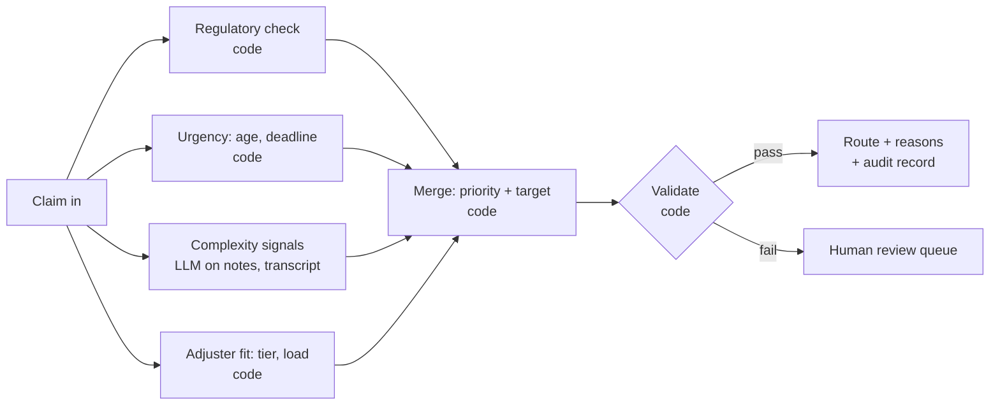

# Slides draft: Meridian discovery readout

Draft content for transfer to Keynote. Each slide has a headline (the claim the slide makes), body content, and speaker notes with sources. Numbers are reproducible with `python3 analysis/review_floor.py`; section numbers refer to its output.

Suggested order: 1 → 2 → 3 → 5 → 4 → demo. Slides 1 and 2 answer "are the goals realistic?" before anyone asks. Slide 5 (stakeholders and flows) comes before slide 4 so the focus follows from the people it serves; it's numbered 5 only because it was added later.

---

## Slide 1: We found a regulatory gap before building anything

**Headline:** 85 claims in the sample needed a human by regulation and may never have been routed to one.

**Body:**

- Two flags on every claim:
  - `requires_human_by_regulation`: rules engine, over $10K in 12 states
  - `flagged_for_human_review`: a second-opinion signal, from a person or low AI confidence
- 85 claims (1.7%) have the regulation flag set and no review flag.
- If routing reads only the review flag, they skipped a required review: **~6,800 claims a year** at 400K volume.
- **Fix:** route to a human when *either* flag is set. One condition in the routing rule.
- **Also found:** 628 claims (~30% of volume) in 8 other states are labeled regulated with no rule anyone has described.

**Visual:** a 2×2 of the two flags (regulated yes/no × flagged yes/no), with the 85 cell highlighted.

**Speaker notes:**

- Lead with this. It's value before any AI, and it's the kind of evidence Michael said makes him a champion (Systems, 37:45).
- Framing: "we need engineering to confirm how routing filters (M14)". Either answer is useful. Don't claim the gap is confirmed.
- The 628: rank the explanations. Legacy rules still running fits best; the ~30% is uniform across all 8 states, which independent state laws wouldn't produce. Point: nobody can say why the flag is set on those claims.
- Tension to name before Pooja does: the fix *raises* the review rate (45.6% → 47.3%).
- It's Meridian's change: rules-engine configuration in a SaaS system, through CAB. Raise with Michael privately first.
- Sources: `docs/discovery/open_questions.md` ("Quick win", "Review floor, revised"); script sections 6 and 9.

---

## Slide 2: The SOW targets, read honestly

**Headline:** One target is within reach, one is hard, and two need redefining.

**Body:**

| Goal | Target | Read | Why |
|---|---|---|---|
| Cycle time | 68h → <24h (simple) | **Reachable** | Simple claims wait 41.7h in queue for 6.1h of handling. Cap the wait at 12h and ~96% land under 24h. It's a routing problem. |
| Cost to serve | −25% blended | **Hard** | Moving *all* fax/EDI to the portal saves ≤8.8%. Needs lighter human work per claim, not just channel shift. |
| Review rate | 45% → <20% | **Near-impossible as measured** | Floor is 12.9% under the stated rule (25.4% as labeled). Even a perfect second-opinion flag leaves ~39%. Closing the gap on slide 1 raises it. |
| CSAT | 3.2 → >4.0 | **Needs redefining** | Denials average 2.24. Non-denied claims would need to average 4.39; today only 5% of them score a 5. 41% of claims have no response. |

**Proposal:** agree measurement plans in the scope document, as the SOW provides. Replace "flag rate" with human minutes per claim or full-review rate; measure CSAT on non-denied claims and communication.

**Speaker notes:**

- The SOW calls targets "directional" and says measurement plans are defined in discovery (`docs/project/sow.md:12`, `:21`). This is the process, not a renegotiation.
- Review rate: a flag doesn't change a claim's cost or speed once complexity is held fixed (script section 8). So what was <20% for? Likely "less human effort per claim". Measure that directly (R5).
- The narrow path to <20% exists: cut *needed* second opinions from 34% of claims to ~7%. Not realistic in six months, on a legacy system we don't control.
- CSAT: "Speed alone will not carry satisfaction" (`reference/analytics_memo.md:27`).
- Sources: script sections 8 and 9; the "Already answered from the data" section of `open_questions.md`.

---

## Slide 3: Five ways to work with a legacy system; two fit here

**Headline:** We build beside ClaimsPro, not inside or instead of it.

**Body:**

| # | Approach | Verdict | Why |
|---|---|---|---|
| 1 | Replace the UI; ClaimsPro as a headless backend | ✗ | Claim decisions can only be entered in the ClaimsPro UI or by batch file, by design |
| 2 | Build inside ClaimsPro with a vendor SDK or plugin | ✗ | No SDK exists |
| 3 | Replace ClaimsPro | ✗ | A system-of-record migration doesn't fit 6 months and $5M |
| 4 | **Write into ClaimsPro's own fields** (notes, custom fields) | ✓ | Custom fields exist; SOAP writes cover notes and documents. Durable, auditable, survives if anything else breaks |
| 5 | **Overlay beside ClaimsPro** (managed browser extension) | ✓ | SaaS in a browser; IT can force-install. Reads the open claim, shows our panel, calls our backend |

**Visual:** five columns, three greyed out; 4 and 5 joined by a bracket labeled "together".

**Speaker notes:**

- 4 and 5 work together: the custom fields are the record (and feed ClaimsPro's own rules and reports); the overlay is the experience. If the extension is down, the fields still show in ClaimsPro.
- Also rejected: bots driving the ClaimsPro screens. They break on every vendor release and would route around the deliberate decisioning gap.
- Not a UI path, but worth one line: fixing fax OCR *before* it enters ClaimsPro (it lands today with no human check).
- "Don't build us an eighth screen" (Ops, 86:20). The overlay sits on the screen they already use.
- Sources: Systems, 4:40 and 5:45; clarification call (SaaS, no SDK, custom fields, force-installable extensions).

---

## Slide 4: Where the first pass goes

**Headline:** Get the right claim to the right adjuster, ready to decide.

**Body:** three layers, each feeding the next:

1. **Routing (deep):** route on both flags; order queues by age and deadline; send hard claims to the right adjuster first. Moves cycle time, the one reachable target.
2. **Custom fields (light):** store *why* a claim was routed, its review lane, and what's been prepared. It's the record, and the hook for later enrichment.
3. **Overlay (draft):** on each claim, a summary, a timeline, the open questions, and why the claim is here. The adjuster decides; nothing is automated.

**The loop:** every correction an adjuster makes (wrong route, wrong summary, missing review) feeds back into routing and the rules, so the next hundred claims don't need the same fix.

**Out of scope for now:** auto-approval (no reliable consent data), precedent search, complex-claim write-ups.

**Speaker notes:**

- Why routing: Sandra's own first fix ("half my cycle-time problem is a dispatch problem", Ops, 20:15), and it moves the one target within reach.
- Why the overlay is a draft: what belongs in the summary needs time with adjusters to find the patterns that matter. What we learn there also improves routing.
- Human in the loop: the adjuster owns every decision. The overlay prepares, explains, and records; it never denies or approves.
- Learning loop: Trevor raised it; the panel will look for it. Example: fix the routing rule once, and the other 84 claims are caught in bulk.

---

## Slide 5: Who this changes, and how we'll know

**Headline:** Five groups, three flows that change, and a measure for each at design time and in production.

**Stakeholders:**

| Who | What they need | What changes for them |
|---|---|---|
| **Adjusters** (95; the second-year is the primary user) | Claims that arrive ready to decide; a reference for hard calls; no eighth screen | Queue arrives ordered with reasons; an overlay prepares each claim; corrections take one click |
| **Senior adjusters and leads** (16) | Time back for complex files; fewer interruptions | Hard claims arrive already routed to them; fewer "can you look at this" escalations |
| **Sandra, claims ops** | Cycle time down without burning people out | A dispatcher she can tune; visibility into why claims sit |
| **Michael and Compliance** | "Show me how you know it's right, and keep showing me" | Every route and summary explained and logged; the regulatory gap closed; drift visible |
| **Carlos** | Cost down, demonstrated not promised | A measured path on the targets that are reachable |

Not direct users but affected: claimants (faster, better-explained outcomes) and the call center (phone intake feeds the same brief later).

**Flows:**

| Flow | Change | Design-time measure (prototype, pilot) | Production measure (OKR) |
|---|---|---|---|
| **Routing: claim arrives → queue → adjuster** | *Change:* round-robin becomes ordered and matched; routes on both flags | Replay the extract: simulated queue wait vs actual; 0 regulated claims unrouted; adjusters agree with the route on sampled claims | **O:** Claims reach the right adjuster without waiting. **KR:** simple-claim median cycle <24h (today 34.7h; 34% under 24h); 0 regulated claims without a review step; escalations to senior review down X% |
| **Preparation: claim opened → ready to decide** | *Create:* the overlay brief, timeline, open questions | Adjuster task test on sample claims: time to first decision, fields re-keyed, "I trust this" rating; extraction accuracy vs adjuster-corrected values | **O:** Adjusters decide, not reassemble. **KR:** handling minutes per claim down X%; second opinions down (26% needed today); brief accuracy ≥ agreed bar on audited sample |
| **Correction: adjuster disagrees → system learns** | *Create:* the learning loop | Corrections take one action; a rule fix finds the similar claims in bulk (the 85) | **O:** The system gets more right each month, visibly. **KR:** correction rate trending down; drift alerts reviewed within a week; no silent rule changes |

**Speaker notes:**

- X% targets are placeholders, agreed in the scope document with Sandra and Michael; the baselines are real and from the extract.
- Change management (Nikolina): pilot with one team and the adjusters who shaped it; nothing takes a decision away from them; the old score comes off the screen only once the new routing has earned trust (M6).
- Every production measure needs a baseline agreed before launch, or month 3 becomes an argument about numbers.

---

## Demo plan (not a slide): the 2–3 hour cut

**One claim, one adjuster, end to end:** IS-CLM-2025004222, the second-year adjuster's New York bodily-injury claim ($59.5K). It waited 117h in queue, took 4 days in senior review, and the notes say he built the injury timeline by hand from a rough transcript.

| Build | Shows | Effort |
|---|---|---|
| **Queue view** with the new routing: claims ordered by age and deadline, each with a reason chip ("regulated: NY over $10K", "missing required review", "route to senior") | Routing, made visible. The UI for routing *is* the explanation of why a claim is where it is | ~30 min |
| **Routing pipeline** (LangGraph, one live LLM node) run on 4222: signals, merge, validation, route with reasons | The engineering depth; the one non-mock piece | ~60 min |
| **Mock ClaimsPro claim page with the overlay panel** for 4222: why it's here (from the pipeline's reasons), a timeline from the transcript and medical summary with low-confidence spots marked, open questions, sources | The adjuster's experience; the human stays in control | ~45 min |
| **Custom fields written back** (shown as ClaimsPro fields updating: review lane, routing reason, brief status) | Approach 4 alongside 5 | ~15 min |
| **One correction loop:** adjuster marks "this should have required review"; the queue shows the 84 similar claims now caught | The learning loop | ~20 min |

**Cut from the timebox:** a real browser extension (mock the page and panel instead), live ClaimsPro API calls, multiple users.

### The one live piece: a routing pipeline in LangGraph

Routing in production is several steps: score each dimension, merge them, validate the result. That's a real graph, which is why it's built in LangGraph rather than as one prompt. Most nodes are plain Python; the LLM handles only what rules can't.

| Node | Type | Why |
|---|---|---|
| Regulatory check | Code | Hard rule: over $10K in a listed state, or either flag set. Never delegated to a model |
| Urgency | Code | Deterministic: queue age, deadline |
| Complexity signals | **LLM** | Reads notes and the rough transcript for what fields don't capture: injury, causation gaps, disputes, low-confidence passages. Returns structured signals with a quoted source for each |
| Adjuster fit | Code | Tier and current load |
| Merge | Code | Weighted and explainable; produces priority, target, and the reasons shown in the UI |
| Validate | Code | Regulated claims must land in a review queue; every LLM quote must appear in the source; otherwise fail safe to human review |

**Containing the live call:**

1. Structured output only, validated against a schema; anything else is rejected.
2. Every signal quotes its source; code checks the quote exists in the input. Unmatched signals are marked unverified and don't affect the route.
3. No decision field exists in the schema: it can raise priority or suggest a target, never approve or deny.
4. Names and policy numbers are masked before the call (decision 4).
5. A recorded response loads automatically on failure, timeout (~20s), or failed validation.
6. One call, on a button, so it's visibly live.
7. Each run writes the five-field audit record, shown in a panel.
8. Bifrost as a local gateway if it goes in cleanly in ~15 minutes: model version, latency, cost feed the audit record. Otherwise call the provider directly.

**Engineering talking points (Pooja):**

- **Hardest part:** the validate node. Making an LLM's output safe to act on means checking it, not trusting it; the fail-safe is always a human queue.
- **Language:** Python or TypeScript is enough. At ~1,100 claims a day (400K a year), throughput isn't the constraint; the LLM call is. Go or Rust only if the merge becomes a hot path, which it won't at this volume.
- **Rules engine:** only if the rules outgrow code: many states, frequent change, owned by Compliance rather than engineers. The 628 unexplained labels are the argument for keeping rules explicit and testable, not buried in a legacy engine. Start in code; revisit if Compliance needs to edit rules themselves.
- **Unhappy paths:** LLM down (recorded fallback, route on code nodes alone); quote not found (signal dropped, marked); regulated claim routed wrongly (validate blocks it); adjuster overrides (logged, feeds the loop).

**Unhappy paths to have ready (Pooja):** the extension isn't loaded (custom fields still show); a low-confidence extraction (marked, with the source shown); the claim is regulated (confirmation required, no fast lane); the adjuster disagrees with the route (the correction is logged and feeds the loop).
